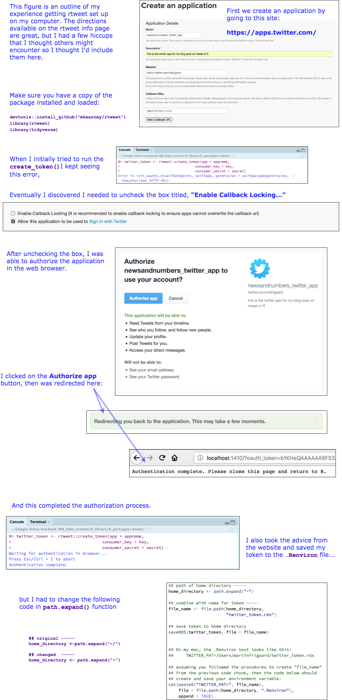

```{r knitr_init, echo=FALSE, message=FALSE, warning=FALSE, cache=FALSE}
library(knitr)
library(rmdformats)
library(magrittr)
library(tidyverse)
## Global options
options(max.print = "75")
opts_chunk$set(eval = FALSE,
	             cache = FALSE,
               prompt = FALSE,
               tidy = FALSE,
               comment = NA,
               message = FALSE,
               warning = FALSE,
               size = "small")
opts_knit$set(width = 75)
# file time ----
file_time <- lubridate::now(tzone = "US/Pacific-New") %>% 
    as.character.Date() 
# what is the file title? ----
file_title <- c("dubnation parade tweets")
# what is the file version? ----
file_version <- c("2.5")
file_title <- stringr::str_to_lower(
    stringr::str_replace_all(file_title, "\\W", "_"))
file_name <- paste0(file_version,"-",file_title, ".Rmd")
# file_name ----
opts_knit$set(width = 75)
file_name

# numvarSum function ----------------------------------------------
# this summarizes a numerical variable (n, na(missing, mean, median, sd,
# variance, min, max, and se) when given a data frame or tibble and
# variable: q14_rpt_fun(df, var)

numvarSum <- function(df, expr) {
  expr <- enquo(expr) # turns expr into a quosure
  summarise(df,
          n = sum((!is.na(!!expr))), # non-missing
          na = sum((is.na(!!expr))), # missing
          mean = mean(!!expr, na.rm = TRUE), # unquotes mean()
          median = median(!!expr, na.rm = TRUE), # unquotes median()
          sd = sd(!!expr, na.rm = TRUE), # unquotes sd()
          variance = var(!!expr, na.rm = TRUE), # unquotes var()
          min = min(!!expr, na.rm = TRUE), # unquotes min()
          max = max(!!expr, na.rm = TRUE), # unquotes max()
          se = sd/sqrt(n)) # standard error
}

timeStamper <- function(...) {
mytime <- stringr::str_sub(string = as.character.Date(Sys.time()),
                 start = 12L,
                 end = 19L)
mydate <- stringr::str_sub(string = as.character.Date(Sys.time()),
                 start = 1L,
                 end = 10L)
mytime <- stringr::str_replace_all(mytime, ":", ".")
paste0(mydate, "%", mytime)
}
```

```{r load_data, eval=TRUE, echo=FALSE}
# fs::dir_ls("Data/tweet_searches")
DubNtnStrngthNmbrs <- read_rds("Data/tweet_searches/2.5/DubNtnStrngthNmbrs2018-06-12%13.00.19.rds")
WarriorsStream <- read_rds("Data/tweet_searches/2.5/WarriorsStream2018-06-12%13.34.23.rds")
WarriorsParadeStream <- read_rds("Data/tweet_searches/2.5/WarriorsParadeStream2018-06-12%13.34.23.rds")
# ls()
```


# Motivation

This post will walk you through 1) collecting data from a Twitter API using the `rtweet` package, 2) creating a map with the tweets using the `ggmap`, `maps`, and `mapdata`, and 3) graphing the tweets with `ggplot2` and `gganimate`.


## Set up the twitter app (with `rtweet`)

You can find excellent documentation on the package [website](http://rtweet.info/), I am just going to go into more detail. 

Install/load the package.

```{r packages, message=FALSE, warning=FALSE, eval=TRUE}
library(tidyverse)
library(rtweet)
library(ggplot2)
library(ggmap)
library(maps)
library(mapdata)
library(gganimate)
library(ggraph)
library(igraph)
library(hrbrthemes)
library(ggalt)   
library(ggthemes) 
```


This is the first step for collecting tweets based on location. See the vignette [here](http://rtweet.info/articles/auth.html). I've outlined this process in the link below. 



## collect a stream of tweets 

We will start by collecting data on a certain hashtag occurrence. Today is June 12th, 2018, and they Golden State Warriors are celebrating their third NBA title '#DubNation celebration'. I'll be searching for the hashtags `#DubNation` and `#StrengthInNumbers`. 

To collect a stream of tweets, we can use the 


The function for collecting tweets is `rtweet::search_tweets()`, and it takes a query `q` (our term). Learn more about this function by typing:

```{r search_tweets_info}
# ?search_tweets
```

We will use all the default settings in this inital search. After the `rtweet::search_tweets()` function has run, I will take a look at this data frame with `dplyr::glimpse()` 

```{r search_tweets_DubTweets, eval=TRUE}
# tweets containing #DubNation
DubTweets <- search_tweets("#DubNation")
```


```{r view_DubTweets, eval=TRUE}
DubTweets %>% glimpse(78)
```


This data set contains `100` observations. If I want more tweets, I need to adjust the cap on the number of tweets I can collect with my API. I can do this by setting the `retryonratelimit` to `TRUE`.

See below from the manual:

> Logical indicating whether to wait and retry when rate limited. This argument is only relevant if the desired return (`n`) exceeds the remaining limit of available requests (assuming no other searches have been conducted in the past 15 minutes, this limit is 18,000 tweets). Defaults to false. Set to `TRUE` to automate process of conducting big searches (i.e., `n > 18000`). For many search queries, esp. specific or specialized searches, there won’t be more than 18,000 tweets to return. But for broad, generic, or popular topics, the total number of tweets within the `REST` window of time (7-10 days) can easily reach the millions.

## Collect data for `#DubNation` and `#StrengthInNumbers` with `rtweet::search_tweets2()`

The `rtweet::search_tweets2()` function works just like the `rtweet::search_tweets()`, but also "***returns data from one OR MORE search queries.***" 

I'll use `rtweet::search_tweets2()` to collect data for two hashtags now, `#DubNation` and `#StrengthInNumbers`, but set the `n` to `50000` and the `retryonratelimit` argument to `TRUE`. 

## Collect data for `#DubNation` and `#StrengthInNumbers` with `rtweet::search_tweets2()`

The `rtweet::search_tweets2()` function works just like the `rtweet::search_tweets()`, but also "***returns data from one OR MORE search queries.***" 

I'll use `rtweet::search_tweets2()` to collect data for two hashtags now, `#DubNation` and `#StrengthInNumbers`, but set the `n` to `100000` and the `retryonratelimit` argument to `TRUE`. 

```{r search_tweets2, eval=FALSE}
## search using multilple queries
DubNtnStrngthNmbrs <- rtweet::search_tweets2(
            c("\"#DubNation\"", 
              "#StrengthInNumbers"), 
            n = 100000, retryonratelimit = TRUE)
```

The structure for this data frame is displayed below with `dplyr::glimpse()`.

```{r DubNtnStrngthNmbrs_glimpse, eval=TRUE}
DubNtnStrngthNmbrs %>% dplyr::glimpse(78)
```

Before I export these data, I will create an `outfile` that pastes together four important pieces of information I want with any exported file:

1. **File Path:** this is the folder destination of the data/object I will be saving
2. **Data Object:** the actual name of the data frame/list being saved 
3. **A timestamp:** a date/time character string (I do this with my custom `timeStamper()` function).
4. **A file extension:** this is either .csv, .rds, .RData or however the data object will be saved.

```{r DubNtnStrngthNmbrs_outfile, eval=FALSE}
tweet_searches_file_path <- "Data/tweet_searches/"
DubNtnStrngthNmbrs_outfile <- paste0(tweet_searches_file_path, "DubNtnStrngthNmbrs",
                                                timeStamper(), ".rds")
DubNtnStrngthNmbrs_outfile
```


```{r export_DubNtnStrngthNmbrs, eval=FALSE}
write_rds(x = DubNtnStrngthNmbrs, path = DubNtnStrngthNmbrs_outfile)
# verify
# dir(tweet_searches_file_path)
```

This data frame has `60,035` observations, and adds one additional variable. We can use the handy `base::setdiff()` to figure out what variables are in `DubNtnStrngthNmbrs` that aren't in `DubTweetsGame3`.

```{r setdiff, eval=TRUE}
base::setdiff(x = names(DubNtnStrngthNmbrs),
              y = names(DubTweets))
```

The `query` variable contains our two search terms. 

```{r count_query, eval=TRUE}
DubNtnStrngthNmbrs %>% count(query)
```


### Get user data with `rtweet::users_data()`

The previous data frame had 87 variables in it, which includes the variables on users and tweets. We can use the `rtweet::users_data()` function to remove the users variables. 

The `base::intersect()` function allows us to see what variables from `DubNtnStrngthNmbrs` will end up in the results from `rtweet::users_data()`.

*I added `tibble::as_tibble()` so the variables print nicely to the screen.*  

```{r intersect_users_data, eval=TRUE}
tibble::as_tibble(base::intersect(x = base::names(DubNtnStrngthNmbrs),
                y = base::names(rtweet::users_data(DubNtnStrngthNmbrs))))
```


I'll store the contents in a new data frame called `UsersDubNtnStrngthNmbrs`.

```{r UsersDubNtnStrngthNmbrs, eval=TRUE}
# get user data 
UsersDubNtnStrngthNmbrs <- rtweet::users_data(DubNtnStrngthNmbrs)
UsersDubNtnStrngthNmbrs %>% glimpse(78)
```

## Get tweet data with `rtweet::tweets_data()`

I can also create another data frame with the tweet information using the `rtweet::tweets_data()` function. Just like above, I will display the variables in this new data frame (but limit it to the top 20).

I will store these variables in the `TweetsDubNtnStrngthNmbrs` data frame. 

```{r tweets_data, eval=TRUE}
tibble::as_tibble(
    intersect(x = base::names(DubNtnStrngthNmbrs),
          y = base::names(rtweet::tweets_data(DubNtnStrngthNmbrs)))) %>% 
          utils::head(20)
TweetsDubNtnStrngthNmbrs <- rtweet::tweets_data(DubNtnStrngthNmbrs)
```

### View the tweets in the `text` column 

The tweets are stored in the column/variable called `text`. I can review the first 10 of these entries with `dplyr::select()` and `utils::head()`.

```{r head_text, eval=TRUE}
DubNtnStrngthNmbrs %>% 
    dplyr::select(text) %>% 
    utils::head(10)
```

I will export these data frames using the methods described above.

```{r TweetsDubNtnStrngthNmbrs_outfile, eval=FALSE}
# ls()
TweetsDubNtnStrngthNmbrs_outfile <- paste0(tweet_searches_file_path, 
                                           "TweetsDubNtnStrngthNmbrs",
                                            timeStamper(), ".rds")
# TweetsDubNtnStrngthNmbrs_outfile
write_rds(x = TweetsDubNtnStrngthNmbrs, path = TweetsDubNtnStrngthNmbrs_outfile)
```


```{r UsersDubNtnStrngthNmbrs_outfile, eval=FALSE}
# ls()
UsersDubNtnStrngthNmbrs_outfile <- paste0(tweet_searches_file_path, 
                                           "UsersDubNtnStrngthNmbrs",
                                            timeStamper(), ".rds")
# UsersDubNtnStrngthNmbrs_outfile
write_rds(x = UsersDubNtnStrngthNmbrs, path = UsersDubNtnStrngthNmbrs_outfile)
# verify
# fs::dir_ls(tweet_searches_file_path)
```

## Get streaming tweets with `rtweet::stream_tweets(()`

This function allows me to collect all tweets mentioning the `WarriorsParade` for a specified amount of time. I will start with `90` seconds. 

```{r WarriorsParadeStream, eval=FALSE}
WarriorsParadeStream <- rtweet::stream_tweets(q = "WarriorsParade", timeout = 90)
# WarriorsParadeStream %>% glimpse(78)
```

```{r ts_plot_WarriorsParadeStream, eval=TRUE}
rtweet::ts_plot(data = WarriorsParadeStream, by = "secs")
ggplot2::ggsave(filename = "Images/2.5-ts_plot_WarriorsParadeStream.png", width = 6.5,height = 4, units = "in")
```

Just for comparison, I will also collect another stream of tweets mentioning `Warriors` for `120` seconds. 

```{r WarriorsStream, eval=FALSE}
WarriorsStream <- rtweet::stream_tweets(q = "Warriors", timeout = 120)
# WarriorsStream %>% glimpse(78)
```

```{r ts_plot_WarriorsStream, eval=TRUE}
rtweet::ts_plot(data = WarriorsStream, by = "secs")
ggplot2::ggsave(filename = "Images/2.5-ts_plot_WarriorsStream.png", width = 6.5,height = 4, units = "in")
```

Now export these data frames so we can archive them. 

```{r export_steam_data, eval=FALSE}
# ls()
WarriorsParadeStream_outfile <- paste0(tweet_searches_file_path, 
                                           "WarriorsParadeStream",
                                            timeStamper(), ".rds")
# WarriorsParadeStream_outfile
# ls()
WarriorsStream_outfile <- paste0(tweet_searches_file_path, 
                                           "WarriorsStream",
                                            timeStamper(), ".rds")
# WarriorsStream_outfile
write_rds(x = WarriorsParadeStream, path = WarriorsParadeStream_outfile)
write_rds(x = WarriorsStream, path = WarriorsStream_outfile)
# verify
# fs::dir_ls("Data/tweet_searches") %>% writeLines()
```

## The timeline of tweets with `rtweet::ts_plot()`

The `rtweet` package also comes with a handy function for plotting tweets over time with `rtweet::ts_plot()`. I added the `ggthemes::theme_gdocs()` theme and made the title text bold with `ggplot2::theme(plot.title = ggplot2::element_text())`.

```{r gg_ts_plot, message=FALSE, warning=FALSE, eval=TRUE, fig.height=4, fig.width=6.5}
gg_ts_plot <- DubNtnStrngthNmbrs %>% 
    rtweet::ts_plot(., by = "10 minutes") +
    ggthemes::theme_gdocs() +
    ggplot2::theme(plot.title = 
                       ggplot2::element_text(face = "bold")) +
    ggplot2::labs(
            x = NULL, 
            y = NULL,
            title = "#DubNation & #StrengthInNumbers tweets",
            caption = "\nSource: Counts aggregated using ten-minute intervals; 
                        data collected using Twitter's REST API via rtweet")
gg_ts_plot
ggplot2::ggsave(filename = "Images/2.5-gg_ts_plot.png", width = 6.5,height = 4, units = "in")
```

This graph shows an increase in tweets for these hashtags between `June 09, 09:21:44 UTC` to `June 12, 19:39:51 UTC`.

## Get longitude and lattitude for tweets in `DubTweets`

I can also add some geographic information to the twitter data (i.e. the latitude and longitude for each tweet) using the `rtweet::lat_lng()` function. 

This function adds a `lat` and `lng` variable to the `DubNtnStrngthNmbrs` data frame.  

*I verify this with `names()` and `tail()`*.

```{r DubNtnStrngthNmbrsLoc, eval=TRUE}
# get lattitude and longitude 
DubNtnStrngthNmbrsLoc <- rtweet::lat_lng(DubNtnStrngthNmbrs)
DubNtnStrngthNmbrs %>% names() %>% tail(2) 
DubNtnStrngthNmbrsLoc %>% names() %>% tail(2) 
```

I will check how many of the tweets have latitude and longitude information using `dplyr::distinct()` and `base::nrow()`.

```{r distinct_lat_lng_nrow, eval=TRUE}
DubNtnStrngthNmbrsLoc %>% dplyr::distinct(lng) %>% base::nrow()
DubNtnStrngthNmbrsLoc %>% dplyr::distinct(lat) %>% base::nrow()
```

Not every tweet has geographic information associated with it, so we will not be graphing all 60,000+ observations. I'll rename `lng` to `long` so it will be easier to join to the state-level data. 

```{r rename_lng, eval=TRUE}
DubNtnStrngthNmbrsLoc <- DubNtnStrngthNmbrsLoc %>% dplyr::rename(long = lng)
```

## Create World Map of #DubNation/#StrengthInNumbers

I will use the `ggplot2::map_data()` function to get the `"world"` data I'll build a map with (save this as `World`).

```{r World, eval=TRUE}
library(maps)
library(mapdata)
World <- ggplot2::map_data("world")
World %>% glimpse(78)
```

The `ggplot2::geom_polygon()` function will create a map with the `World` data. The variables that build the map are `long` and `lat` (you can see why I renamed the `lng` variable to `long` in `DubNtnStrngthNmbrsLoc`). I added the Warrior team colors with `fill` and `color`.

```{r ggWorldMap, message=FALSE, warning=FALSE, eval=TRUE, fig.height=4, fig.width=6.5}
ggWorldMap <- ggplot2::ggplot() + 
    ggplot2::geom_polygon(data = World, 
                            aes(x = long, 
                                y = lat, 
                                group = group), 
                                fill = "royalblue", 
                                color = "gainsboro",
                                alpha = 0.5) 
ggWorldMap + 
     ggplot2::theme(plot.title = ggplot2::element_text(face = "bold")) + 
     ggplot2::labs(title = "Basic World Map (geom_polygon)")

ggplot2::ggsave(filename = "Images/2.5-ggWorldMap.png", width = 6.5,height = 4, units = "in")
```

## Add the tweet data to the map

Now that I have a basic projection of the world, I can layer the twitter data onto the map with `ggplot2::geom_point()` by specifying the `long` and `lat` to `x` and `y`. The `data` argument also needs to be specified because we will be introducing a second data set (and will not be using the `World` data).

This is what's referred to as the `mercator` projection. It is the default setting in `coord_quickmap()`. I also add the `ggthemes::theme_map()` for a cleaner print of the map (without ticks and axes)

```{r gg_mercator_dubstrngth, message=FALSE, warning=FALSE, eval=TRUE, fig.height=4, fig.width=6.5}
gg_Merc_title <- "  Worldwide (Mercator) #DubNation and #StrengthInNumbers tweets"
gg_Merc_cap <- "tweets collected with rtweet; \nhashtags #DubNation and #StrengthInNumbers"
gg_mercator_dubstrngth <- ggWorldMap + 
    ggplot2::coord_quickmap() +
        ggplot2::geom_point(data = DubNtnStrngthNmbrsLoc, 
                        aes(x = long, y = lat), 
                        size = 0.9, # reduce size of points
                        fill = "gainsboro",
                        color = "orangered1") +
    # add titles/labels
     ggplot2::theme(plot.title = ggplot2::element_text(face = "bold")) + 
        ggplot2::labs(title = gg_Merc_title, 
        caption = gg_Merc_cap) +
        ggthemes::theme_map() 
gg_mercator_dubstrngth
ggplot2::ggsave(filename = "Images/2.5-gg_mercator_dubstrngth.png", width = 6.5,height = 4, units = "in")
```

The Mercator projection works well for navigation because the meridians are equally spaced (the grid lines that runs north and south), but the parallels (the lines that run east/west around) are not equally spaced. This causes a distortion in the land masses at both poles. The map above makes it look like Greenland is roughly 1/2 or 2/3 the size of Africa, when in reality Africa is 14x larger.

## Mapping with the Winkel tripel projection

An alternative to the Mercator projection is the [Winkel tripel](https://en.wikipedia.org/wiki/Winkel_tripel_projection) projection. This map attempts to correct the distortions in the Mercator map. 

This map gets added via the `ggalt::coord_proj()` function, which takes a projection argument from the `proj4` [package.](https://cran.r-project.org/web/packages/proj4/index.html) I add the Winkel tripel layer with `ggplot2::coord_proj("+proj=wintri")` below. 


```{r ggDubWinkelTrip, message=FALSE, warning=FALSE, eval=TRUE, fig.height=4, fig.width=6.5}
# convert query to factor (you'll see why later)
DubNtnStrngthNmbrsLoc$query <- factor(DubNtnStrngthNmbrsLoc$query, 
                          labels = c("#DubNation", "#StrengthInNumbers"))
# define titles 
ggDubWT_title <- "Worldwide (Winkel tripel) #DubNation &\n#StrengthInNumbers tweets"
ggDubWT_cap <- "tweets collected with rtweet package; \nhashtags #DubNation and #StrengthInNumbers  "

#  create world map 
ggWorld2 <- ggplot2::ggplot() + 
    ggplot2::geom_map(data = World, map = World,
                    aes(x = long, 
                        y = lat, 
                        map_id = region),
                    size = 0.009,
                    fill = "royalblue", 
                    alpha = 0.6) 
        #  add the twiiter data layer
ggDubWinkelTrip <- ggWorld2 + 
    ggplot2::geom_point(data = DubNtnStrngthNmbrsLoc, 
            aes(x = long, 
                y = lat),   
                    color = "orangered1",
                    size = 0.9) +
        # add Winkel tripel layer
        ggalt::coord_proj("+proj=wintri") +
            ggplot2::theme(plot.title = ggplot2::element_text(
                                                face = "bold")) + 
            ggplot2::labs(
            title = ggDubWT_title, 
            caption = ggDubWT_cap) 
ggDubWinkelTrip
ggplot2::ggsave(filename = "Images/2.5-ggDubWinkelTrip.png", width = 6.5,height = 4, units = "in")
```

This map is an ok start, but I want to add some additional customization:

+ I'll start by adjusting the x axis manually with `ggplot2::scale_x_continuous()` (this gives a full 'globe' on the map),  
+ I add the FiveThiryEight theme from `ggthemes::theme_fivethirtyeight()`,  
+ Remove the `x` and `y` axis labels with two `ggplot2::theme()` statements,  
+ Finally, facet these maps by the query type (`#DubNation` or `#StrengthInNumbers`)  

```{r ggDubWinkelTripFacet, message=FALSE, warning=FALSE, eval=TRUE, fig.height=4, fig.width=6.5}
ggDubWinkelTripFacet <- ggDubWinkelTrip + 
    ggplot2::scale_x_continuous(limits = c(-200, 200)) +
     ggthemes::theme_fivethirtyeight() +
    ggplot2::theme(
        axis.title.y = element_blank(),
        axis.text.y = element_blank(),
        axis.ticks.y = element_blank()) +
    ggplot2::theme(
        axis.title.x = element_blank(),
        axis.text.x = element_blank(),
        axis.ticks.x = element_blank()) +
    ggplot2::labs(title = ggDubWT_title, 
        caption = ggDubWT_cap) +
    facet_wrap( ~ query)
ggDubWinkelTripFacet
ggplot2::ggsave(filename = "Images/2.5-ggDubWinkelTripFacet.png", width = 6.5,height = 4, units = "in")
```

To learn more about maps check out [this document](https://pubs.usgs.gov/pp/1453/report.pdf) put out by the U.S. Geological Survey on map projections. The description provided in the show [West Wing](https://www.youtube.com/watch?v=vVX-PrBRtTY) covers some of the distortions in the Mercator map, and this video from [Vox](https://www.youtube.com/watch?v=kIID5FDi2JQ) does a great job illustrating the difficulties in rendering a sphere or globe on a 2-d surface. 

## Animate the timeline of tweets with `gganiamte`

`rtweet` can collect twitter data over a period of 7-10 days, but the data I have in `DubNtnStrngthNmbrsLoc` only ranges from `"2018-06-09 07:40:22 UTC"` until `"2018-06-10 02:36:31 UTC"`. 

I want to see the spread of the `#DubNation` and `#StrengthInNumbers` tweets across the globe, but I want to use the point `size` in this this animated map to indicate the number of followers associated with each tweet. `gganimate` is the ideal package for this because it works well with `ggplot2`. 

I can start by looking at the number of followers each twitter account had (`followers_count`) and the observations with location information (`long` and `lat`). 

```{r retweet_count, eval=TRUE}
DubNtnStrngthNmbrsLoc %>% 
    # identify observations with complete location information
        dplyr::filter(!is.na(long) | 
                  !is.na(lat)) %>%
    # get the sorted count
    dplyr::select(followers_count, screen_name) %>% 
    # arrange these descending
    dplyr::arrange(desc(followers_count)) 
```

This looks like there are a few `screen_name`s with > 100,000 followers. I can get a quick view of the distribution of this variable with `qplot()` 
```{r check_distribution_for_outliers, eval=TRUE, message=TRUE, warning=TRUE,  fig.height=4, fig.width=6.5}
gg_freqploy_title <- "Frequency of followers_count for #DubNation &\n#StrengthInNumbers tweets"
DubNtnStrngthNmbrsLoc %>% 
        # identify observations with complete location information
        dplyr::filter(!is.na(long) | 
                  !is.na(lat)) %>%
        ggplot2::qplot(x = followers_count, 
                       data = ., 
                       geom = "freqpoly") +
            ggplot2::theme(plot.title = ggplot2::element_text(
                                                face = "bold", size = 14)) + 
            ggplot2::labs(
            title = gg_freqploy_title, 
            caption = ggDubWT_cap) 
ggplot2::ggsave(filename = "Images/2.5-gg_freqpolyv1.1.png", width = 6.5,height = 4, units = "in")
```

This long tail tells me that these outliers are skewing the distribution. I want to see what the distribution looks like without these extremely high counts of retweets 

```{r gg_freqpolyv1.2.png, eval=TRUE, message=TRUE, warning=TRUE, fig.height=4, fig.width=6.5}
DubNtnStrngthNmbrsLoc %>% 
    # remove observations without location information
    dplyr::filter(!is.na(long) | 
                  !is.na(lat)) %>% 
    # arrange data
    dplyr::arrange(desc(followers_count)) %>% 
    # remove the follower_count that are above 100000
    dplyr::filter(followers_count < 100000) %>% 
        ggplot2::qplot(followers_count, 
                       data = ., 
                       geom = "freqpoly") +
            ggplot2::theme(plot.title = ggplot2::element_text(
                                                face = "bold", size = 12)) + 
            ggplot2::labs(
            title = gg_freqploy_title, 
            caption = ggDubWT_cap) 
ggplot2::ggsave(filename = "Images/2.5-gg_freqpolyv1.2.png", width = 6.5,height = 4, units = "in")
```

This still looks skewed, but now we can see more of a distribution of followers. The majority of the observations fall under 10 followers, with few reaching above 20, so I will remove the observations with more than 100 followers.

```{r DubAnimateData, eval=TRUE}
DubAnimateData <- DubNtnStrngthNmbrsLoc %>% 
    # remove observations without location information
    dplyr::filter(!is.na(long) | 
                  !is.na(lat)) %>% 
    # arrange data descending 
    dplyr::arrange(desc(retweet_count)) %>% 
    # remove the follower_count that are above 100000
    dplyr::filter(retweet_count < 100000) %>% 
    # select only the variables we will be visualizing 
    dplyr::select(user_id,
                  status_id,
                  screen_name,
                  followers_count,
                  retweet_count,
                  created_at,
                  text,
                  long,
                  hashtags,
                  lat)
DubAnimateData %>% glimpse(78)
```

Great! Now I will create another static Winkel tripel map before animating it get an idea for what it will look like. I start with the `ggWorld2` base from above, then layer in the twitter data, this time specifying `size = followers_count` and `ggplot2::scale_size_continuous()`. The `range` is the number of different points, and the `breaks` are the cut-offs for each size.


I also remove the `x` and `y` axis labels, and add the `ggthemes::theme_hc()` for a crisp looking finish. 

```{r gg_themehc_v1.0, eval=TRUE, message=TRUE, warning=TRUE, fig.height=4, fig.width=6.5}
ggWorld2 +
  geom_point(aes(x = long, 
                 y = lat, 
                 size = followers_count),
             data = DubAnimateData, 
             color = "magenta2", alpha = 0.4) +
  ggplot2::scale_size_continuous(range = c(1, 6), 
                                breaks = c(1, 10, 20, 
                                           30, 40, 50)) +
  labs(size = "Retweets") + 
    ggalt::coord_proj("+proj=wintri") + 
    ggthemes::theme_hc() +
    ggplot2::theme(
        axis.title.y = element_blank(),
        axis.text.y = element_blank(),
        axis.ticks.y = element_blank()) +
    ggplot2::theme(
        axis.title.x = element_blank(),
        axis.text.x = element_blank(),
        axis.ticks.x = element_blank()) + 
    ggplot2::theme(plot.title = ggplot2::element_text(
                                face = "bold", size = 12)) + 
    ggplot2::labs(title = "#DubNation & #StrengthInNumbers",
                  subtitle = "tweets and followers")
ggplot2::ggsave(filename = "Images/2.5-gg_themehc_v1.0.png", width = 6.5, height = 4, units = "in")
```

 I learned a helpful tip from Daniela Vasquez over at [d4tagirl](https://d4tagirl.com/2017/05/how-to-plot-animated-maps-with-gganimate) to build two data frames to use for displaying the animation before and after the points start appearing. These are best built using dates just outside the range of the `created_at` field. 

```{r create_empty_data_frame, eval=TRUE, message=FALSE, warning=FALSE}
library(tibble)
library(lubridate)
# min(DubAnimateData$created_at) # "2018-06-09 09:22:21 UTC"
# max(DubAnimateData$created_at) # "2018-06-12 19:37:27 UTC"
# create data frame foe the beginning of the animation
EmptyAnimateDataBegin <- tibble(
        created_at = as_datetime("2018-06-09 09:21:21 UTC"),
        followers_count = 0, 
        long = 0, 
        lat = 0)
EmptyAnimateDataBegin
# create data frame for the end of the animation
EmptyAnimateDataEnd <- tibble(
  created_at = seq(as_datetime("2018-06-12 19:50:00 UTC"),
                   as_datetime("2018-06-12 21:00:00 UTC"),
                   by = "min"), 
                followers_count = 0, 
                long = 0, 
                lat = 0)
EmptyAnimateDataEnd
```

Now I can use these two data frames to add additional layers to the animation. `gganimate` takes a `frame` argument, which is the value we want the `followers_count` to change over time (`created_at`).

The `cumulative = TRUE` tells R to leave the point on the map after its been plotted. 

```{r DubMap, eval=FALSE, echo=TRUE}
DubMap <- ggWorld2 +
  geom_point(aes(x = long, 
                 y = lat, 
                 size = followers_count,
                 frame = created_at,
                 cumulative = TRUE),
             data = DubAnimateData, 
             color = "magenta2", 
             alpha = 0.3) +
    # transparent frame 1
  geom_point(aes(x = long, 
                y = lat, 
                size = followers_count, 
                frame = created_at,
                cumulative = TRUE),
                        data = EmptyAnimateDataBegin, 
                        alpha = 0) +
    # transparent frame 2
  geom_point(aes(x = long, 
                y = lat, 
                size = followers_count, 
                frame = created_at,
                cumulative = TRUE),
                        data = EmptyAnimateDataEnd, 
                        alpha = 0) +
  ggplot2::scale_size_continuous(range = c(1, 6), 
                                breaks = c(1, 10, 20, 
                                           30, 40, 50)) +
  labs(size = 'Retweets') + 
    ggalt::coord_proj("+proj=wintri") + 
    ggthemes::theme_hc() +
    ggplot2::theme(
        axis.title.y = element_blank(),
        axis.text.y = element_blank(),
        axis.ticks.y = element_blank()) +
    ggplot2::theme(
        axis.title.x = element_blank(),
        axis.text.x = element_blank(),
        axis.ticks.x = element_blank()) + 
    ggplot2::labs(title = "#DubNation & #StrengthInNumbers",
                  subtitle = "tweets and followers")
library(gganimate)
gganimate(DubMap, interval = .2, "DubMapv2.0.gif")
```


Now I have an animation that displays the tweets as they appeared in the two days following the NBA finals. 

## Export the data 

`rtweet` has a handy export function for these twitter data frames as .csv files. 

```{r export_data, eval=FALSE}
# ls()
processed_data_file_path <- "Data/processed_data/"
# DubAnimateData
DubAnimateData_outfile <- paste0(processed_data_file_path, "DubAnimateData",
                                                timeStamper(), ".csv")
# export
rtweet::write_as_csv(x = DubAnimateData,
                 file_name = DubAnimateData_outfile)

# DubNtnStrngthNmbrs
DubNtnStrngthNmbrs_outfile <- paste0(processed_data_file_path, "DubNtnStrngthNmbrs",
                                                timeStamper(), ".csv")
# export
rtweet::write_as_csv(x = DubNtnStrngthNmbrs,
                 file_name = DubNtnStrngthNmbrs_outfile)

# DubNtnStrngthNmbrsLoc
DubNtnStrngthNmbrsLoc_outfile <- paste0(processed_data_file_path, "DubNtnStrngthNmbrsLoc",
                                                timeStamper(), ".csv")
# export
rtweet::write_as_csv(x = DubNtnStrngthNmbrsLoc,
                 file_name = DubNtnStrngthNmbrsLoc_outfile)

# UsersDubNtnStrngthNmbrs
UsersDubNtnStrngthNmbrs_outfile <- paste0(processed_data_file_path, "UsersDubNtnStrngthNmbrs",
                                                timeStamper(), ".csv")
# export
rtweet::write_as_csv(x = UsersDubNtnStrngthNmbrs,
                 file_name = UsersDubNtnStrngthNmbrs_outfile)

# TweetsDubNtnStrngthNmbrs
TweetsDubNtnStrngthNmbrs_outfile <- paste0(processed_data_file_path, "TweetsDubNtnStrngthNmbrs",
                                                timeStamper(), ".csv")
# export
rtweet::write_as_csv(x = TweetsDubNtnStrngthNmbrs,
                 file_name = TweetsDubNtnStrngthNmbrs_outfile)
# WarriorsParadeStream
WarriorsParadeStream_outfile <- paste0(processed_data_file_path, "WarriorsParadeStream",
                                                timeStamper(), ".csv")
# export
rtweet::write_as_csv(x = WarriorsParadeStream,
                 file_name = WarriorsParadeStream_outfile)
# WarriorsStream
WarriorsStream_outfile <- paste0(processed_data_file_path, "WarriorsStream",
                                                timeStamper(), ".csv")
# export
rtweet::write_as_csv(x = WarriorsStream,
                 file_name = WarriorsStream_outfile)
```

To learn more check out these awesome resources: 

1. [Computing for the Social Sciences](https://goo.gl/m7wA6r)
2. [Making Maps with R](https://goo.gl/h4EszF)
3. [socviz - chapter 7 - Draw maps](https://goo.gl/ibYJuJ)
4. [gganimate package](https://github.com/dgrtwo/gganimate)  
5. [twitter api object definitions](https://developer.twitter.com/en/docs/tweets/data-dictionary/overview/intro-to-tweet-json)


