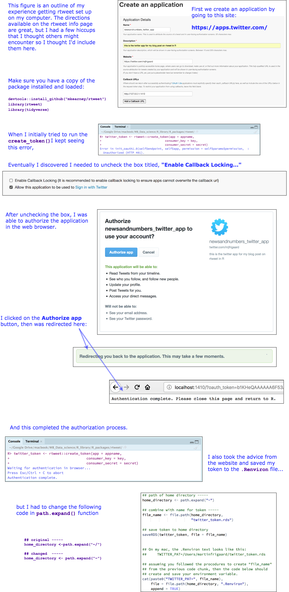

Collecting and mapping tweets in R
================

    ## [1] "2.4-collecting_tweets.Rmd"

<!-- Load data -->

    Data/tweet_searches/2.3-DubNtnStrngthNmbrs-2018-06-09-21-39-28.rds
    Data/tweet_searches/2.3-DubTweetsGame3-2018-06-06.rds
    Data/tweet_searches/2.3-TweetsDubNtnStrngthNmbrs-2018-06-09-22-04-30.rds
    Data/tweet_searches/2.3-UsersDubNtnStrngthNmbrs-2018-06-09-21-46-45.rds

# Motivation

This post will walk you through 1) collecting data from a Twitter API
using the `rtweet` package, 2) creating a map with the tweets using the
`ggmap`, `maps`, and `mapdata`, and 3) graphing the tweets with You can
find excellent documentation on the package
[website](http://rtweet.info/), I am just going to go into more detail.

## Set up the twitter app (with `rtweet`)

Install/load the package

``` r
library(tidyverse)
library(rtweet)
library(ggplot2)
library(ggmap)
library(maps)
library(mapdata)
library(gganimate)
library(ggraph)
library(igraph)
library(hrbrthemes)
library(ggalt)
library(ggthemes)
```

This is the first step for collecting tweets based on location. See the
vignette [here](http://rtweet.info/articles/auth.html). I’ve outlined
this process in the link below.



## Searching for word occurances in tweets

We will start by collecting data on a certain hashtag occurrence. When I
am writing this, it is game three of the NBA finals, so I will search
for the hastag `#DubNation`. The function for collecting tweets is
`rtweet::search_tweets()`, and it takes a query `q` (our term).

Learn more about this function by typing:

``` r
# ?search_tweets
```

We will use all the default settings in this inital search.

``` r
# tweets containing #DubNation
DubTweetsGame3 <- search_tweets("#DubNation")
```

After the `rtweet::search_tweets()` function has run, I will take a look
at this data frame with `dplyr::glimpse()`

``` r
DubTweetsGame3 %>% dplyr::glimpse(78)
```

    Observations: 15,004
    Variables: 87
    $ user_id                 <chr> "1000036251272187904", "10002061971721216...
    $ status_id               <chr> "1004574929558257665", "10045813096442019...
    $ created_at              <dttm> 2018-06-07 04:05:01, 2018-06-07 04:30:23...
    $ screen_name             <chr> "hsn_sports", "MahmoudZaytoon8", "Wholelo...
    $ text                    <chr> "\U0001f3c0 Golden State Warriors, Kevin ...
    $ source                  <chr> "Twitter for Android", "Twitter for Andro...
    $ display_text_width      <dbl> 168, 140, 139, 143, 35, 72, 101, 45, 98, ...
    $ reply_to_status_id      <chr> NA, NA, NA, NA, NA, NA, NA, NA, NA, NA, N...
    $ reply_to_user_id        <chr> NA, NA, NA, NA, NA, NA, NA, NA, NA, NA, N...
    $ reply_to_screen_name    <chr> NA, NA, NA, NA, NA, NA, NA, NA, NA, NA, N...
    $ is_quote                <lgl> FALSE, FALSE, FALSE, FALSE, FALSE, FALSE,...
    $ is_retweet              <lgl> FALSE, TRUE, TRUE, TRUE, FALSE, TRUE, TRU...
    $ favorite_count          <int> 1, 0, 0, 0, 0, 0, 0, 1, 1, 0, 0, 0, 0, 0,...
    $ retweet_count           <int> 0, 1210, 1816, 1393, 0, 8963, 508, 1, 1, ...
    $ hashtags                <list> [<"DubNation", "NBAFinals">, <"NBAFinals...
    $ symbols                 <list> [NA, NA, NA, NA, NA, NA, NA, NA, NA, NA,...
    $ urls_url                <list> [NA, NA, NA, NA, NA, NA, NA, NA, NA, NA,...
    $ urls_t.co               <list> [NA, NA, NA, NA, NA, NA, NA, NA, NA, NA,...
    $ urls_expanded_url       <list> [NA, NA, NA, NA, NA, NA, NA, NA, NA, NA,...
    $ media_url               <list> ["http://pbs.twimg.com/tweet_video_thumb...
    $ media_t.co              <list> ["https://t.co/08UGymu2xy", NA, NA, NA, ...
    $ media_expanded_url      <list> ["https://twitter.com/hsn_sports/status/...
    $ media_type              <list> ["photo", NA, NA, NA, "photo", "photo", ...
    $ ext_media_url           <list> ["http://pbs.twimg.com/tweet_video_thumb...
    $ ext_media_t.co          <list> ["https://t.co/08UGymu2xy", NA, NA, NA, ...
    $ ext_media_expanded_url  <list> ["https://twitter.com/hsn_sports/status/...
    $ ext_media_type          <chr> NA, NA, NA, NA, NA, NA, NA, NA, NA, NA, N...
    $ mentions_user_id        <list> [NA, "19923144", <"19923144", "26270913"...
    $ mentions_screen_name    <list> [NA, "NBA", <"NBA", "warriors">, <"NBA",...
    $ lang                    <chr> "tr", "en", "en", "en", "und", "und", "en...
    $ quoted_status_id        <chr> NA, NA, NA, NA, NA, NA, NA, NA, NA, NA, N...
    $ quoted_text             <chr> NA, NA, NA, NA, NA, NA, NA, NA, NA, NA, N...
    $ quoted_created_at       <dttm> NA, NA, NA, NA, NA, NA, NA, NA, NA, NA, ...
    $ quoted_source           <chr> NA, NA, NA, NA, NA, NA, NA, NA, NA, NA, N...
    $ quoted_favorite_count   <int> NA, NA, NA, NA, NA, NA, NA, NA, NA, NA, N...
    $ quoted_retweet_count    <int> NA, NA, NA, NA, NA, NA, NA, NA, NA, NA, N...
    $ quoted_user_id          <chr> NA, NA, NA, NA, NA, NA, NA, NA, NA, NA, N...
    $ quoted_screen_name      <chr> NA, NA, NA, NA, NA, NA, NA, NA, NA, NA, N...
    $ quoted_name             <chr> NA, NA, NA, NA, NA, NA, NA, NA, NA, NA, N...
    $ quoted_followers_count  <int> NA, NA, NA, NA, NA, NA, NA, NA, NA, NA, N...
    $ quoted_friends_count    <int> NA, NA, NA, NA, NA, NA, NA, NA, NA, NA, N...
    $ quoted_statuses_count   <int> NA, NA, NA, NA, NA, NA, NA, NA, NA, NA, N...
    $ quoted_location         <chr> NA, NA, NA, NA, NA, NA, NA, NA, NA, NA, N...
    $ quoted_description      <chr> NA, NA, NA, NA, NA, NA, NA, NA, NA, NA, N...
    $ quoted_verified         <lgl> NA, NA, NA, NA, NA, NA, NA, NA, NA, NA, N...
    $ retweet_status_id       <chr> NA, "1004445319499845632", "1004567827133...
    $ retweet_text            <chr> NA, "Get pumped for Game 3... with Steph ...
    $ retweet_created_at      <dttm> NA, 2018-06-06 19:30:00, 2018-06-07 03:3...
    $ retweet_source          <chr> NA, NA, NA, NA, NA, NA, NA, NA, NA, NA, N...
    $ retweet_favorite_count  <int> NA, 3967, 4078, 3501, NA, 13970, 1689, NA...
    $ retweet_retweet_count   <int> NA, 1210, 1816, 1393, NA, 8963, 508, NA, ...
    $ retweet_user_id         <chr> NA, "19923144", "19923144", "19923144", N...
    $ retweet_screen_name     <chr> NA, "NBA", "NBA", "NBA", NA, "warriors", ...
    $ retweet_name            <chr> NA, "NBA", "NBA", "NBA", NA, "Golden Stat...
    $ retweet_followers_count <int> NA, 27819753, 27819758, 27819758, NA, 583...
    $ retweet_friends_count   <int> NA, 1664, 1664, 1664, NA, 987, 1664, NA, ...
    $ retweet_statuses_count  <int> NA, 201209, 201209, 201209, NA, 76309, 20...
    $ retweet_location        <chr> NA, "", "", "", NA, "Oakland, CA", "", NA...
    $ retweet_description     <chr> NA, "30 teams, 1 goal. #ThisIsWhyWePlay",...
    $ retweet_verified        <lgl> NA, TRUE, TRUE, TRUE, NA, TRUE, TRUE, NA,...
    $ place_url               <chr> NA, NA, NA, NA, NA, NA, NA, NA, NA, NA, N...
    $ place_name              <chr> NA, NA, NA, NA, NA, NA, NA, NA, NA, NA, N...
    $ place_full_name         <chr> NA, NA, NA, NA, NA, NA, NA, NA, NA, NA, N...
    $ place_type              <chr> NA, NA, NA, NA, NA, NA, NA, NA, NA, NA, N...
    $ country                 <chr> NA, NA, NA, NA, NA, NA, NA, NA, NA, NA, N...
    $ country_code            <chr> NA, NA, NA, NA, NA, NA, NA, NA, NA, NA, N...
    $ geo_coords              <list> [<NA, NA>, <NA, NA>, <NA, NA>, <NA, NA>,...
    $ coords_coords           <list> [<NA, NA>, <NA, NA>, <NA, NA>, <NA, NA>,...
    $ bbox_coords             <list> [<NA, NA, NA, NA, NA, NA, NA, NA>, <NA, ...
    $ name                    <chr> "HSN Sports", "Mahmoud Zaytoon", "Wholelo...
    $ location                <chr> "", "الأسكندرية, مصر", "Fort Myers, FL", ...
    $ description             <chr> "", "Ahly Barça Liverpool ❤", "Sc\U0001f4...
    $ url                     <chr> NA, NA, NA, NA, "https://t.co/4NGzgl9FKn"...
    $ protected               <lgl> FALSE, FALSE, FALSE, FALSE, FALSE, FALSE,...
    $ followers_count         <int> 10, 27, 8, 8, 22, 1, 4, 313, 313, 20, 20,...
    $ friends_count           <int> 104, 268, 48, 48, 90, 7, 144, 156, 156, 7...
    $ listed_count            <int> 0, 0, 0, 0, 0, 0, 0, 0, 0, 0, 0, 0, 0, 0,...
    $ statuses_count          <int> 41, 18, 8, 8, 320, 4, 1, 335, 335, 166, 1...
    $ favourites_count        <int> 0, 138, 0, 0, 328, 3, 5, 98, 98, 163, 163...
    $ account_created_at      <dttm> 2018-05-25 15:29:56, 2018-05-26 02:45:15...
    $ verified                <lgl> FALSE, FALSE, FALSE, FALSE, FALSE, FALSE,...
    $ profile_url             <chr> NA, NA, NA, NA, "https://t.co/4NGzgl9FKn"...
    $ profile_expanded_url    <chr> NA, NA, NA, NA, "http://www.instagram.com...
    $ account_lang            <chr> "tr", "en", "en", "en", "en", "en", "en",...
    $ profile_banner_url      <chr> "https://pbs.twimg.com/profile_banners/10...
    $ profile_background_url  <chr> NA, NA, NA, NA, NA, NA, NA, NA, NA, NA, N...
    $ profile_image_url       <chr> "http://pbs.twimg.com/profile_images/1000...

This data set contains `15,004` observations. If I want more tweets, I
need to adjust the cap on the number of tweets I can collect with my
API. I can do this by setting the `retryonratelimit` to `TRUE`.

See below from the manual:

> Logical indicating whether to wait and retry when rate limited. This
> argument is only relevant if the desired return (`n`) exceeds the
> remaining limit of available requests (assuming no other searches have
> been conducted in the past 15 minutes, this limit is 18,000 tweets).
> Defaults to false. Set to `TRUE` to automate process of conducting big
> searches (i.e., `n > 18000`). For many search queries, esp. specific
> or specialized searches, there won’t be more than 18,000 tweets to
> return. But for broad, generic, or popular topics, the total number of
> tweets within the `REST` window of time (7-10 days) can easily reach
> the
millions.

## Collect data for `#DubNation` and `#StrengthInNumbers` with `rtweet::search_tweets2()`

The `rtweet::search_tweets2()` function works just like the
`rtweet::search_tweets()`, but also “***returns data from one OR MORE
search queries.***”

I’ll use `rtweet::search_tweets2()` to collect data for two hashtags
now, `#DubNation` and `#StrengthInNumbers`, but set the `n` to `50000`
and the `retryonratelimit` argument to
`TRUE`.

## Collect data for `#DubNation` and `#StrengthInNumbers` with `rtweet::search_tweets2()`

The `rtweet::search_tweets2()` function works just like the
`rtweet::search_tweets()`, but also “***returns data from one OR MORE
search queries.***”

I’ll use `rtweet::search_tweets2()` to collect data for two hashtags
now, `#DubNation` and `#StrengthInNumbers`, but set the `n` to `50000`
and the `retryonratelimit` argument to `TRUE`.

``` r
## search using multilple queries
DubNtnStrngthNmbrs <- rtweet::search_tweets2(
            c("\"#DubNation\"",
              "#StrengthInNumbers"),
            n = 50000, retryonratelimit = TRUE)
```

The structure for this data frame is displayed below with
`dplyr::glimpse()`

``` r
DubNtnStrngthNmbrs %>% dplyr::glimpse(78)
```

    Observations: 56,966
    Variables: 88
    $ user_id                 <chr> "1000031071675744256", "10000310716757442...
    $ status_id               <chr> "1005524470843441153", "10055250664933744...
    $ created_at              <dttm> 2018-06-09 18:58:10, 2018-06-09 19:00:32...
    $ screen_name             <chr> "Gracinha_pxt", "Gracinha_pxt", "Gracinha...
    $ text                    <chr> "RT @warriors: #DubNation, your 2018 Cham...
    $ source                  <chr> "Twitter for iPhone", "Twitter for iPhone...
    $ display_text_width      <dbl> 140, 103, 63, 140, 77, 140, 140, 139, 123...
    $ reply_to_status_id      <chr> NA, NA, NA, NA, NA, NA, NA, NA, NA, NA, N...
    $ reply_to_user_id        <chr> NA, NA, NA, NA, NA, NA, NA, NA, NA, NA, N...
    $ reply_to_screen_name    <chr> NA, NA, NA, NA, NA, NA, NA, NA, NA, NA, N...
    $ is_quote                <lgl> FALSE, FALSE, FALSE, FALSE, FALSE, FALSE,...
    $ is_retweet              <lgl> TRUE, TRUE, TRUE, TRUE, TRUE, TRUE, TRUE,...
    $ favorite_count          <int> 0, 0, 0, 0, 0, 0, 0, 0, 0, 0, 0, 0, 0, 0,...
    $ retweet_count           <int> 1136, 92, 148, 1, 6, 1136, 1136, 1012, 14...
    $ hashtags                <list> ["DubNation", <"DubNation", "NBAFinals",...
    $ symbols                 <list> [NA, NA, NA, NA, NA, NA, NA, NA, NA, NA,...
    $ urls_url                <list> [NA, NA, NA, NA, NA, NA, NA, NA, NA, NA,...
    $ urls_t.co               <list> [NA, NA, NA, NA, NA, NA, NA, NA, NA, NA,...
    $ urls_expanded_url       <list> [NA, NA, NA, NA, NA, NA, NA, NA, NA, NA,...
    $ media_url               <list> [NA, "http://pbs.twimg.com/media/DfOVWIN...
    $ media_t.co              <list> [NA, "https://t.co/kSbS11eZxy", "https:/...
    $ media_expanded_url      <list> [NA, "https://twitter.com/GloballyCurry3...
    $ media_type              <list> [NA, "photo", "photo", NA, "photo", NA, ...
    $ ext_media_url           <list> [NA, "http://pbs.twimg.com/media/DfOVWIN...
    $ ext_media_t.co          <list> [NA, "https://t.co/kSbS11eZxy", "https:/...
    $ ext_media_expanded_url  <list> [NA, "https://twitter.com/GloballyCurry3...
    $ ext_media_type          <chr> NA, NA, NA, NA, NA, NA, NA, NA, NA, NA, N...
    $ mentions_user_id        <list> ["26270913", "735871787875991553", "7358...
    $ mentions_screen_name    <list> ["warriors", "GloballyCurry30", "Globall...
    $ lang                    <chr> "en", "en", "und", "pt", "en", "en", "en"...
    $ quoted_status_id        <chr> NA, NA, NA, NA, NA, NA, NA, NA, NA, NA, N...
    $ quoted_text             <chr> NA, NA, NA, NA, NA, NA, NA, NA, NA, NA, N...
    $ quoted_created_at       <dttm> NA, NA, NA, NA, NA, NA, NA, NA, NA, NA, ...
    $ quoted_source           <chr> NA, NA, NA, NA, NA, NA, NA, NA, NA, NA, N...
    $ quoted_favorite_count   <int> NA, NA, NA, NA, NA, NA, NA, NA, NA, NA, N...
    $ quoted_retweet_count    <int> NA, NA, NA, NA, NA, NA, NA, NA, NA, NA, N...
    $ quoted_user_id          <chr> NA, NA, NA, NA, NA, NA, NA, NA, NA, NA, N...
    $ quoted_screen_name      <chr> NA, NA, NA, NA, NA, NA, NA, NA, NA, NA, N...
    $ quoted_name             <chr> NA, NA, NA, NA, NA, NA, NA, NA, NA, NA, N...
    $ quoted_followers_count  <int> NA, NA, NA, NA, NA, NA, NA, NA, NA, NA, N...
    $ quoted_friends_count    <int> NA, NA, NA, NA, NA, NA, NA, NA, NA, NA, N...
    $ quoted_statuses_count   <int> NA, NA, NA, NA, NA, NA, NA, NA, NA, NA, N...
    $ quoted_location         <chr> NA, NA, NA, NA, NA, NA, NA, NA, NA, NA, N...
    $ quoted_description      <chr> NA, NA, NA, NA, NA, NA, NA, NA, NA, NA, N...
    $ quoted_verified         <lgl> NA, NA, NA, NA, NA, NA, NA, NA, NA, NA, N...
    $ retweet_status_id       <chr> "1005498277033226241", "10053120874077143...
    $ retweet_text            <chr> "#DubNation, your 2018 Champs \U0001f3c6 ...
    $ retweet_created_at      <dttm> 2018-06-09 17:14:05, 2018-06-09 04:54:14...
    $ retweet_source          <chr> NA, NA, NA, NA, NA, NA, NA, NA, NA, NA, N...
    $ retweet_favorite_count  <int> 5080, 316, 397, 1, 15, 5080, 5080, 4685, ...
    $ retweet_retweet_count   <int> 1136, 92, 148, 1, 6, 1136, 1136, 1012, 14...
    $ retweet_user_id         <chr> "26270913", "735871787875991553", "735871...
    $ retweet_screen_name     <chr> "warriors", "GloballyCurry30", "GloballyC...
    $ retweet_name            <chr> "Golden State Warriors", "Team Wardell SC...
    $ retweet_followers_count <int> 5863529, 44051, 44051, 70, 90, 5863529, 5...
    $ retweet_friends_count   <int> 986, 4933, 4933, 84, 121, 986, 986, 26, 1...
    $ retweet_statuses_count  <int> 76452, 6888, 6888, 189, 25, 76452, 76452,...
    $ retweet_location        <chr> "Oakland, CA", "World Wide - Warriors", "...
    $ retweet_description     <chr> "\U0001f3c6\U0001f3c6\U0001f3c6\U0001f3c6...
    $ retweet_verified        <lgl> TRUE, FALSE, FALSE, FALSE, FALSE, TRUE, T...
    $ place_url               <chr> NA, NA, NA, NA, NA, NA, NA, NA, NA, NA, N...
    $ place_name              <chr> NA, NA, NA, NA, NA, NA, NA, NA, NA, NA, N...
    $ place_full_name         <chr> NA, NA, NA, NA, NA, NA, NA, NA, NA, NA, N...
    $ place_type              <chr> NA, NA, NA, NA, NA, NA, NA, NA, NA, NA, N...
    $ country                 <chr> NA, NA, NA, NA, NA, NA, NA, NA, NA, NA, N...
    $ country_code            <chr> NA, NA, NA, NA, NA, NA, NA, NA, NA, NA, N...
    $ geo_coords              <list> [<NA, NA>, <NA, NA>, <NA, NA>, <NA, NA>,...
    $ coords_coords           <list> [<NA, NA>, <NA, NA>, <NA, NA>, <NA, NA>,...
    $ bbox_coords             <list> [<NA, NA, NA, NA, NA, NA, NA, NA>, <NA, ...
    $ name                    <chr> "Karen Peixoto", "Karen Peixoto", "Karen ...
    $ location                <chr> "Santa Cruz, Rio de Janeiro", "Santa Cruz...
    $ description             <chr> "Twitter novo, o outro foi bloqueado. Jes...
    $ url                     <chr> NA, NA, NA, NA, NA, "https://t.co/fbyfQas...
    $ protected               <lgl> FALSE, FALSE, FALSE, FALSE, FALSE, FALSE,...
    $ followers_count         <int> 129, 129, 129, 50, 86, 63, 1, 10, 2, 11, ...
    $ friends_count           <int> 127, 127, 127, 68, 91, 161, 20, 235, 102,...
    $ listed_count            <int> 0, 0, 0, 0, 0, 0, 0, 0, 0, 0, 1, 0, 0, 0,...
    $ statuses_count          <int> 340, 340, 340, 128, 191, 1844, 29, 12, 10...
    $ favourites_count        <int> 1556, 1556, 1556, 60, 55, 744, 9, 6, 13, ...
    $ account_created_at      <dttm> 2018-05-25 15:09:22, 2018-05-25 15:09:22...
    $ verified                <lgl> FALSE, FALSE, FALSE, FALSE, FALSE, FALSE,...
    $ profile_url             <chr> NA, NA, NA, NA, NA, "https://t.co/fbyfQas...
    $ profile_expanded_url    <chr> NA, NA, NA, NA, NA, "http://Instagram.com...
    $ account_lang            <chr> "en", "en", "en", "pt", "pt", "en", "zh-T...
    $ profile_banner_url      <chr> "https://pbs.twimg.com/profile_banners/10...
    $ profile_background_url  <chr> NA, NA, NA, NA, NA, NA, NA, NA, NA, NA, "...
    $ profile_image_url       <chr> "http://pbs.twimg.com/profile_images/1005...
    $ query                   <chr> "\"#DubNation\"", "\"#DubNation\"", "\"#D...

This data frame has `56,966` observations, and adds one additional
variable. We can use the handy `base::setdiff()` to figure out what
variables are in `DubNtnStrngthNmbrs` that aren’t in `DubTweetsGame3`.

``` r
base::setdiff(x = names(DubNtnStrngthNmbrs),
              y = names(DubTweetsGame3))
```

    [1] "query"

The `query` variable contains our two search terms.

``` r
DubNtnStrngthNmbrs %>% count(query)
```

    # A tibble: 2 x 2
      query                  n
      <chr>              <int>
    1 "\"#DubNation\""   34349
    2 #StrengthInNumbers 22617

### Get user data with `rtweet::users_data()`

The previous data frame had 87 variables in it, which includes the
variables on users and tweets. We can use the `rtweet::users_data()`
function to remove the users variables.

The `base::intersect()` function allows us to see what variables from
`DubNtnStrngthNmbrs` will end up in the results from
`rtweet::users_data()`.

*I added `tibble::as_tibble()` so the variables print nicely to the
screen.*

``` r
tibble::as_tibble(base::intersect(x = base::names(DubNtnStrngthNmbrs),
                y = base::names(rtweet::users_data(DubNtnStrngthNmbrs))))
```

```
# A tibble: 20 x 1
   value
   <chr>
 1 user_id
 2 screen_name
 3 name
 4 location
 5 description
 6 url
 7 protected
 8 followers_count
 9 friends_count
10 listed_count
11 statuses_count
12 favourites_count
13 account_created_at
14 verified
15 profile_url
16 profile_expanded_url
17 account_lang
18 profile_banner_url
19 profile_background_url
20 profile_image_url
```

I’ll store the contents in a new data frame called
`UsersDubNtnStrngthNmbrs`.

``` r
# get user data
UsersDubNtnStrngthNmbrs <- rtweet::users_data(DubNtnStrngthNmbrs)
UsersDubNtnStrngthNmbrs %>% glimpse(78)
```

    Observations: 56,966
    Variables: 20
    $ user_id                <chr> "1000031071675744256", "100003107167574425...
    $ screen_name            <chr> "Gracinha_pxt", "Gracinha_pxt", "Gracinha_...
    $ name                   <chr> "Karen Peixoto", "Karen Peixoto", "Karen P...
    $ location               <chr> "Santa Cruz, Rio de Janeiro", "Santa Cruz,...
    $ description            <chr> "Twitter novo, o outro foi bloqueado. Jesu...
    $ url                    <chr> NA, NA, NA, NA, NA, "https://t.co/fbyfQas8...
    $ protected              <lgl> FALSE, FALSE, FALSE, FALSE, FALSE, FALSE, ...
    $ followers_count        <int> 129, 129, 129, 50, 86, 63, 1, 10, 2, 11, 6...
    $ friends_count          <int> 127, 127, 127, 68, 91, 161, 20, 235, 102, ...
    $ listed_count           <int> 0, 0, 0, 0, 0, 0, 0, 0, 0, 0, 1, 0, 0, 0, ...
    $ statuses_count         <int> 340, 340, 340, 128, 191, 1844, 29, 12, 102...
    $ favourites_count       <int> 1556, 1556, 1556, 60, 55, 744, 9, 6, 13, 5...
    $ account_created_at     <dttm> 2018-05-25 15:09:22, 2018-05-25 15:09:22,...
    $ verified               <lgl> FALSE, FALSE, FALSE, FALSE, FALSE, FALSE, ...
    $ profile_url            <chr> NA, NA, NA, NA, NA, "https://t.co/fbyfQas8...
    $ profile_expanded_url   <chr> NA, NA, NA, NA, NA, "http://Instagram.com/...
    $ account_lang           <chr> "en", "en", "en", "pt", "pt", "en", "zh-TW...
    $ profile_banner_url     <chr> "https://pbs.twimg.com/profile_banners/100...
    $ profile_background_url <chr> NA, NA, NA, NA, NA, NA, NA, NA, NA, NA, "h...
    $ profile_image_url      <chr> "http://pbs.twimg.com/profile_images/10056...

## Get tweet data with `rtweet::tweets_data()`

I can also create another data frame with the tweet information using
the `rtweet::tweets_data()` function. Just like above, I will display
the variables in this new data frame (but limit it to the top 20).

I will store these variables in the `TweetsDubNtnStrngthNmbrs` data
frame.

``` r
tibble::as_tibble(
    intersect(x = base::names(DubNtnStrngthNmbrs),
          y = base::names(rtweet::tweets_data(DubNtnStrngthNmbrs)))) %>%
          utils::head(20)
```

```
# A tibble: 20 x 1
   value
   <chr>
 1 user_id
 2 status_id
 3 created_at
 4 screen_name
 5 text
 6 source
 7 display_text_width
 8 reply_to_status_id
 9 reply_to_user_id
10 reply_to_screen_name
11 is_quote
12 is_retweet
13 favorite_count
14 retweet_count
15 hashtags
16 symbols
17 urls_url
18 urls_t.co
19 urls_expanded_url
20 media_url
```

``` r
TweetsDubNtnStrngthNmbrs <- rtweet::tweets_data(DubNtnStrngthNmbrs)
```

### View the tweets in the `text` column

The tweets are stored in the column/variable called `text`. We can
review the first 10 of these entries with `dplyr::select()` and
`utils::head()`.

``` r
DubNtnStrngthNmbrs %>%
    dplyr::select(text) %>%
    utils::head(10)
```

    # A tibble: 10 x 1
       text
       <chr>
     1 RT @warriors: #DubNation, your 2018 Champs 🏆 will arrive back home thi…
     2 RT @GloballyCurry30: Greatest. Of. All. Time. #DubNation #NBAFinals #N…
     3 RT @GloballyCurry30: #DubNation #WEBACK https://t.co/brNLP7JbRh
     4 RT @indepocrlh: Espero q para o ano ao menos a final seja mais disputa…
     5 "RT @gbrandaoc11: Another one!💙💛\n#DubNation #NBAFinals https://t.co/J…
     6 RT @warriors: #DubNation, your 2018 Champs 🏆 will arrive back home thi…
     7 RT @warriors: #DubNation, your 2018 Champs 🏆 will arrive back home thi…
     8 RT @TripleH: Three @NBA Championships out of the last four years. Cong…
     9 "RT @NBA: Coach @SteveKerr and @QCook323 share a moment as NBA champs!…
    10 RT @KiannaDy: Congrats GSW!!!! 💙💛💙💛 #DubNation https://t.co/Ij6xl5ZZlq…

## The timeline of tweets with `rtweet::ts_plot()`

The `rtweet` package also comes with a handy function for plotting
tweets over time with `rtweet::ts_plot()`. I added the
`ggthemes::theme_gdocs()` theme and made the title text bold with
`ggplot2::theme(plot.title = ggplot2::element_text())`.

``` r
gg_ts_plot <- DubNtnStrngthNmbrs %>%
    rtweet::ts_plot(., by = "15 minutes") +
    ggthemes::theme_gdocs() +
    ggplot2::theme(plot.title =
                       ggplot2::element_text(face = "bold")) +
    ggplot2::labs(
            x = NULL,
            y = NULL,
            title = "#DubNation & #StrengthInNumbers tweets",
            caption = "\nSource: Counts aggregated using fifteen-minute intervals;
                        data collected using Twitter's REST API via rtweet")
gg_ts_plot
```


``` r
ggsave(filename = "Images/gg_ts_plot.png", width = 6.5, height = 4, units = "in")
```

This graph shows an increase in tweets for these hashtags between
`June 09, 12:00` to `June 09, 18:00`.

## Get longitude and lattitude for tweets in `DubTweets`

I can also add some geographic information to the twitter data (i.e. the
latitude and longitude for each tweet) using the `rtweet::lat_lng()`
function.

This function adds a `lat` and `lng` variable to the
`DubNtnStrngthNmbrs` data frame.

*I verify this with `names()` and `tail()`*.

``` r
# get lattitude and longitude
DubNtnStrngthNmbrsLoc <- rtweet::lat_lng(DubNtnStrngthNmbrs)
DubNtnStrngthNmbrs %>% names() %>% tail(2)
```

```
[1] "profile_image_url" "query"
```

``` r
DubNtnStrngthNmbrsLoc %>% names() %>% tail(2)
```

    [1] "lat" "lng"

I will check how many of the tweets have latitude and longitude
information using `dplyr::distinct()` and `base::nrow()`.

``` r
DubNtnStrngthNmbrsLoc %>% dplyr::distinct(lng) %>% base::nrow()
```

    [1] 198

``` r
DubNtnStrngthNmbrsLoc %>% dplyr::distinct(lat) %>% base::nrow()
```

    [1] 198

Not every tweet has geographic information associated with it, so we
will not be graphing all `56,966` observations. I’ll rename `lng` to
`long` so it will be easier to join to the state-level
data.

``` r
DubNtnStrngthNmbrsLoc <- DubNtnStrngthNmbrsLoc %>% dplyr::rename(long = lng)
```

## Create World Map of \#DubNation/\#StrengthInNumbers

I will use the `ggplot2::map_data()` function to get the `"world"` data
I’ll build a map with (save this as `World`).

``` r
library(maps)
library(mapdata)
World <- ggplot2::map_data("world")
World %>% glimpse(78)
```

    Observations: 99,338
    Variables: 6
    $ long      <dbl> -69.90, -69.90, -69.94, -70.00, -70.07, -70.05, -70.04,...
    $ lat       <dbl> 12.45, 12.42, 12.44, 12.50, 12.55, 12.60, 12.61, 12.57,...
    $ group     <dbl> 1, 1, 1, 1, 1, 1, 1, 1, 1, 1, 2, 2, 2, 2, 2, 2, 2, 2, 2...
    $ order     <int> 1, 2, 3, 4, 5, 6, 7, 8, 9, 10, 12, 13, 14, 15, 16, 17, ...
    $ region    <chr> "Aruba", "Aruba", "Aruba", "Aruba", "Aruba", "Aruba", "...
    $ subregion <chr> NA, NA, NA, NA, NA, NA, NA, NA, NA, NA, NA, NA, NA, NA,...

The `ggplot2::geom_polygon()` function will create a map with the
`World` data. The variables that build the map are `long` and `lat` (you
can see why I renamed the `lng` variable to `long` in
`DubNtnStrngthNmbrsLoc`). I added the Warrior team colors with `fill`
and `color`.

``` r
ggWorldMap <- ggplot2::ggplot() +
    ggplot2::geom_polygon(data = World,
                            aes(x = long,
                                y = lat,
                                group = group),
                                fill = "gold",
                                color = "royalblue",
                                alpha = 0.6)
ggWorldMap +
     ggplot2::theme(plot.title = ggplot2::element_text(face = "bold")) +
     ggplot2::labs(title = "Basic World Map (geom_polygon)")
```


``` r
ggsave(filename = "Images/ggWorldMap.png",
       width = 6.5,
       height = 4,
       units = "in")
```

## Add the tweet data to the map

Now that I have a basic projection of the world, I can layer the twitter
data onto the map with `ggplot2::geom_point()` by specifying the `long`
and `lat` to `x` and `y`. The `data` argument also needs to be specified
because we will be introducing a second data set (and will not be using
the `World` data).

This is what’s referred to as the `mercator` projection. It is the
default setting in `coord_quickmap()`. I also add the
`ggthemes::theme_map()` for a cleaner print of the map (without ticks
and
axes)

``` r
gg_Merc_title <- "  Worldwide (Mercator) #DubNation and #StrengthInNumbers tweets"
gg_Merc_cap <- "tweets collected with rtweet the hashtags #DubNation and #StrengthInNumbers"
gg_mercator_dubstrngth <- ggWorldMap +
    ggplot2::coord_quickmap() +
        ggplot2::geom_point(data = DubNtnStrngthNmbrsLoc,
                        aes(x = long, y = lat),
                        size = 0.7, # reduce size of points
                        color = "firebrick") +
    # add titles/labels
     ggplot2::theme(plot.title = ggplot2::element_text(face = "bold")) +
        ggplot2::labs(title = gg_Merc_title,
        caption = gg_Merc_cap) +
        ggthemes::theme_map()
gg_mercator_dubstrngth
```


``` r
ggplot2::ggsave(filename = "Images/gg_mercator_dubstrngth.png",
                width = 6.5,
                height = 4,
                units = "in")
```

The Mercator projection works well for navigation because the meridians
are equally spaced (the grid lines that runs north and south), but the
parallels (the lines that run east/west around) are not equally spaced.
This causes a distortion in the land masses at both poles. The map above
makes it look like Greenland is roughly 1/2 or 2/3 the size of Africa,
when in reality Africa is 14x larger.

## Mapping with the Winkel tripel projection

An alternative to the Mercator projection is the [Winkel
tripel](https://en.wikipedia.org/wiki/Winkel_tripel_projection)
projection. This map attempts to correct the distortions in the Mercator
map.

This map gets added via the `ggalt::coord_proj()` function, which takes
a projection argument from the `proj4`
[package.](https://cran.r-project.org/web/packages/proj4/index.html) I
add the Winkel tripel layer with `ggplot2::coord_proj("+proj=wintri")`
below.

``` r
# convert query to factor (you'll see why later)
DubNtnStrngthNmbrsLoc$query <- factor(DubNtnStrngthNmbrsLoc$query,
                          labels = c("#DubNation", "#StrengthInNumbers"))
# define titles
ggDubWT_title <- "Worldwide (Winkel tripel) #DubNation &\n#StrengthInNumbers tweets"
ggDubWT_cap <- "tweets collected with rtweet the hashtags #DubNation and #StrengthInNumbers  "

#  create world map
ggWorld2 <- ggplot2::ggplot() +
    ggplot2::geom_map(data = World, map = World,
                    aes(x = long,
                        y = lat,
                        map_id = region),
                    size = 0.009,
                    fill = "gold",
                    alpha = 0.4)
        #  add the twiiter data layer
ggDubWinkelTrip <- ggWorld2 +
    ggplot2::geom_point(data = DubNtnStrngthNmbrsLoc,
            aes(x = long,
                y = lat),
                    color = "royalblue",
                    size = 0.4) +
        # add Winkel tripel layer
        ggalt::coord_proj("+proj=wintri") +
            ggplot2::theme(plot.title = ggplot2::element_text(
                                                face = "bold")) +
            ggplot2::labs(
            title = ggDubWT_title,
            caption = ggDubWT_cap)
ggDubWinkelTrip
```


``` r
ggsave(filename = "Images/ggDubWinkelTrip.png", width = 6.5, height = 4, units = "in")
```

This map is an ok start, but I want to add some additional
customization:

  - I’ll start by adjusting the x axis manually with
    `ggplot2::scale_x_continuous()` (this gives a full ‘globe’ on the
    map),
  - I add the FiveThiryEight theme from
    `ggthemes::theme_fivethirtyeight()`,
  - Remove the `x` and `y` axis labels with two `ggplot2::theme()`
    statements,
  - Finally, facet these maps by the query type (`#DubNation` or
    `#StrengthInNumbers`)

<!-- end list -->

``` r
ggDubWinkelTripFacet <- ggDubWinkelTrip +
    ggplot2::scale_x_continuous(limits = c(-200, 200)) +
     ggthemes::theme_fivethirtyeight() +
    ggplot2::theme(
        axis.title.y = element_blank(),
        axis.text.y = element_blank(),
        axis.ticks.y = element_blank()) +
    ggplot2::theme(
        axis.title.x = element_blank(),
        axis.text.x = element_blank(),
        axis.ticks.x = element_blank()) +
    ggplot2::labs(title = ggDubWT_title,
        caption = ggDubWT_cap) +
    facet_wrap( ~ query)
ggDubWinkelTripFacet
```


``` r
ggsave(filename = "Images/ggDubWinkelTripFacet.png",
       width = 6.5,
       height = 4,
       units = "in")
```

To learn more about maps check out [this
document](https://pubs.usgs.gov/pp/1453/report.pdf) put out by the U.S.
Geological Survey on map projections. The description provided in the
show [West Wing](https://www.youtube.com/watch?v=vVX-PrBRtTY) covers
some of the distortions in the Mercator map, and this video from
[Vox](https://www.youtube.com/watch?v=kIID5FDi2JQ) does a great job
illustrating the difficulties in rendering a sphere or globe on a 2-d
surface.

## Animate the timeline of tweets with `gganiamte`

`rtweet` can collect twitter data over a period of 7-10 days, but the
data I have in `DubNtnStrngthNmbrsLoc` only ranges from
`"2018-06-09 07:40:22 UTC"` until `"2018-06-10 02:36:31 UTC"`.

I want to see the spread of the `#DubNation` and `#StrengthInNumbers`
tweets across the globe, but I want to use the point `size` in this this
animated map to indicate the number of followers associated with each
tweet. `gganimate` is the ideal package for this because it works well
with `ggplot2`.

I can start by looking at the number of followers for each account
(`followers_count`) on the observations with location information
(`long` and `lat`).

``` r
DubNtnStrngthNmbrsLoc %>%
    # identify observations with complete location information
        dplyr::filter(!is.na(long) |
                  !is.na(lat)) %>%
    # get the sorted count
    dplyr::select(followers_count, screen_name) %>%
    # arrange these descending
    dplyr::arrange(desc(followers_count)) %>% head(10)
```

```
# A tibble: 10 x 2
   followers_count screen_name
             <int> <chr>
 1          424668 realfredrosser
 2          424666 realfredrosser
 3           30297 jgibbard
 4           30297 jgibbard
 5           18962 Lakeshore23
 6           16800 coreydu
 7           12333 billsowah1
 8           10404 tigerbeat
 9            8260 jeanquan
10            8260 jeanquan
```

This looks like there are a few `screen_name`s with \> 10000 followers.
I can get a quick view of the distribution of this variable with
`qplot()`

```r
gg_freqploy_title <- "Frequency of followers_count for #DubNation &\n#StrengthInNumbers tweets"
DubNtnStrngthNmbrsLoc %>%
        # identify observations with complete location information
        dplyr::filter(!is.na(long) |
                  !is.na(lat)) %>%
        ggplot2::qplot(x = followers_count,
                       data = .,
                       geom = "freqpoly") +
            ggplot2::theme(plot.title = ggplot2::element_text(
                                                face = "bold", size = 14)) +
            ggplot2::labs(
            title = gg_freqploy_title,
            caption = ggDubWT_cap)
```


``` r
ggsave(filename = "Images/gg_freqpolyv1.2.png",
       width = 6.5,
       height = 4,
       units = "in")
```

    `stat_bin()` using `bins = 30`. Pick better value with `binwidth`.

This long tail tells me that these outliers are skewing the
distribution. I want to see what the distribution looks like without
these extremely high counts of followers.

``` r
DubNtnStrngthNmbrsLoc %>%
    # remove observations without location information
    dplyr::filter(!is.na(long) |
                  !is.na(lat)) %>%
    # arrange data
    dplyr::arrange(desc(followers_count)) %>%
    # remove followers with more than 10,000 followers
    dplyr::filter(followers_count < 10000) %>%
        ggplot2::qplot(followers_count,
                       data = .,
                       geom = "freqpoly") +
            ggplot2::theme(plot.title = ggplot2::element_text(
                                                face = "bold", size = 12)) +
            ggplot2::labs(
            title = gg_freqploy_title,
            caption = ggDubWT_cap)
```

<!-- -->

``` r
ggsave(filename = "Images/gg_freqpolyv1.2.png", width = 6.5, height = 4, units = "in")
```

This still looks skewed, but now we can see more of a distribution of
followers. The majority of the observations fall under 2500 followers,
with a few reaching above 7500. I will remove the observations with more
than 10,000 followers.

``` r
DubAnimateData <- DubNtnStrngthNmbrsLoc %>%
    # remove observations without location information
    dplyr::filter(!is.na(long) |
                  !is.na(lat)) %>%
    # arrange data descending
    dplyr::arrange(desc(followers_count)) %>%
    # remove the follower_count that are above 10,000
    dplyr::filter(followers_count < 10000) %>%
    # select only the variables we will be visualizing
    dplyr::select(user_id,
                  status_id,
                  screen_name,
                  followers_count,
                  friends_count,
                  favourites_count,
                  created_at,
                  text,
                  long,
                  hashtags,
                  lat)
DubAnimateData %>% glimpse(78)
```

    Observations: 469
    Variables: 11
    $ user_id          <chr> "115334561", "115334561", "115334561", "12583976...
    $ status_id        <chr> "1005481675470471171", "1005481675470471171", "1...
    $ screen_name      <chr> "jeanquan", "jeanquan", "jeanquan", "JackieKPIX"...
    $ followers_count  <int> 8260, 8260, 8260, 7230, 7230, 7229, 7229, 7229, ...
    $ friends_count    <int> 1829, 1829, 1829, 348, 348, 348, 348, 348, 1960,...
    $ favourites_count <int> 366, 366, 366, 2358, 2358, 2358, 2358, 2358, 493...
    $ created_at       <dttm> 2018-06-09 16:08:07, 2018-06-09 16:08:07, 2018-...
    $ text             <chr> "#Sweep!  Pure #joy and #love for the #dubnation...
    $ long             <dbl> -122.23, -122.23, -122.23, -122.23, -122.23, -12...
    $ hashtags         <list> [<"Sweep", "joy", "love", "dubnation", "back2ba...
    $ lat              <dbl> 37.792, 37.792, 37.792, 37.792, 37.792, 37.792, ...

Great\! Now I will create another static Winkel tripel map before
animating it get an idea for what it will look like. I start with the
`ggWorld2` base from above, then layer in the twitter data, this time
specifying `size = followers_count` and
`ggplot2::scale_size_continuous()`. The `range` is the number of
different points, and the `breaks` are the cut-offs for each size.

I also remove the `x` and `y` axis labels, and add the
`ggthemes::theme_hc()` for a crisp looking finish.

``` r
ggWorld2 +
  geom_point(aes(x = long,
                 y = lat,
                 size = followers_count),
             data = DubAnimateData,
             color = "royalblue", alpha = .2) +
  ggplot2::scale_size_continuous(range = c(1, 6),
                                breaks = c(500, 1000, 2000,
                                           4000, 6000, 8000)) +
  labs(size = "Followers") +
    ggalt::coord_proj("+proj=wintri") +
    ggthemes::theme_hc() +
    ggplot2::theme(
        axis.title.y = element_blank(),
        axis.text.y = element_blank(),
        axis.ticks.y = element_blank()) +
    ggplot2::theme(
        axis.title.x = element_blank(),
        axis.text.x = element_blank(),
        axis.ticks.x = element_blank()) +
    ggplot2::theme(plot.title = ggplot2::element_text(
                                face = "bold", size = 12)) +
    ggplot2::labs(title = "#DubNation & #StrengthInNumbers",
                  subtitle = "tweets and followers")
```

<!-- -->

``` r
ggsave(filename = "Images/gg_themehc_v1.0.png", width = 6.5, height = 4, units = "in")
```

I learned a helpful tip from Daniela Vasquez over at
[d4tagirl](https://d4tagirl.com/2017/05/how-to-plot-animated-maps-with-gganimate)
to build two data frames to use for displaying the animation before and
after the points start appearing. These are best built using dates just
outside the range of the `created_at` field.

``` r
library(tibble)
library(lubridate)
# min(DubAnimateData$created_at) # "2018-06-09 07:43:46 UTC"
# max(DubAnimateData$created_at) # "2018-06-10 02:36:31 UTC"
# create data frame foe the beginning of the animation
EmptyAnimateDataBegin <- tibble(
        created_at = as_datetime("2018-06-09 07:43:46 UTC"),
        followers_count = 0,
        long = 0,
        lat = 0)
EmptyAnimateDataBegin
```

    # A tibble: 1 x 4
      created_at          followers_count  long   lat
      <dttm>                        <dbl> <dbl> <dbl>
    1 2018-06-09 07:43:46               0     0     0

``` r
# create data frame for the end of the animation
EmptyAnimateDataEnd <- tibble(
  created_at = seq(as_datetime("2018-06-10 03:00:00 UTC"),
                   as_datetime("2018-06-10 04:00:00 UTC"),
                   by = "min"),
                followers = 0,
                long = 0,
                lat = 0)
EmptyAnimateDataEnd
```

    # A tibble: 61 x 4
       created_at          followers  long   lat
       <dttm>                  <dbl> <dbl> <dbl>
     1 2018-06-10 03:00:00         0     0     0
     2 2018-06-10 03:01:00         0     0     0
     3 2018-06-10 03:02:00         0     0     0
     4 2018-06-10 03:03:00         0     0     0
     5 2018-06-10 03:04:00         0     0     0
     6 2018-06-10 03:05:00         0     0     0
     7 2018-06-10 03:06:00         0     0     0
     8 2018-06-10 03:07:00         0     0     0
     9 2018-06-10 03:08:00         0     0     0
    10 2018-06-10 03:09:00         0     0     0
    # ... with 51 more rows

Now I can use these two data frames to add additional layers to the
animation. `gganimate` takes a `frame` argument, which is the value we
want the `followers_count` to change over time (`created_at`).

The `cumulative = TRUE` tells R to leave the point on the map after its
been plotted.

``` r
DubMap <- ggWorld2 +
  geom_point(aes(x = long,
                 y = lat,
                 size = followers_count,
                 frame = created_at,
                 cumulative = TRUE),
             data = DubAnimateData,
             color = "royalblue",
             alpha = .2) +
    # transparent frame 1
  geom_point(aes(x = long,
                y = lat,
                size = followers,
                frame = created_at,
                cumulative = TRUE),
                        data = ghost_points_ini,
                        alpha = 0) +
    # transparent frame 2
  geom_point(aes(x = long,
                y = lat,
                size = followers,
                frame = created_at,
                cumulative = TRUE),
                        data = ghost_points_fin,
                        alpha = 0) +
  scale_size_continuous(range = c(1, 6),
                        breaks = c(500, 1000, 2000, 4000, 6000, 8000)) +
  labs(size = 'Followers') +
    ggalt::coord_proj("+proj=wintri") +
    ggthemes::theme_hc() +
    ggplot2::theme(
        axis.title.y = element_blank(),
        axis.text.y = element_blank(),
        axis.ticks.y = element_blank()) +
    ggplot2::theme(
        axis.title.x = element_blank(),
        axis.text.x = element_blank(),
        axis.ticks.x = element_blank()) +
    ggplot2::labs(title = "#DubNation & #StrengthInNumbers",
                  subtitle = "tweets and followers")
library(gganimate)
gganimate(DubMap, interval = .2, "DubMap.gif")
```


Now I have an animation that displays the tweets as they appeared in the
two days following the NBA finals.

## Export the data

`rtweet` has a handy export function for these twitter data frames as
.csv files.

``` r
rtweet::write_as_csv(x = DubNtnStrngthNmbrsLoc,
                 file_name = "Data/Processed/DubNtnStrngthNmbrsLoc.csv")

rtweet::write_as_csv(x = DubNtnStrngthNmbrs,
                 file_name = "Data/Processed/DubNtnStrngthNmbrs.csv")

rtweet::write_as_csv(x = DubTweetsGame3,
                 file_name = "Data/Processed/DubTweetsGame3.csv")

rtweet::write_as_csv(x = DubAnimateData,
                 file_name = "Data/Processed/DubAnimateData.csv")

rtweet::write_as_csv(x = TweetsDubNtnStrngthNmbrs,
                 file_name = "Data/Processed/TweetsDubNtnStrngthNmbrs.csv")

rtweet::write_as_csv(x = UsersDubNtnStrngthNmbrs,
                 file_name = "Data/Processed/UsersDubNtnStrngthNmbrs.csv")
```


To learn more check out these awesome resources:

1.  [Computing for the Social Sciences](https://goo.gl/m7wA6r)
2.  [Making Maps with R](https://goo.gl/h4EszF)
3.  [socviz - chapter 7 - Draw maps](https://goo.gl/ibYJuJ)
4.  [gganimate package](https://github.com/dgrtwo/gganimate)
5.  [twitter api object
    definitions](https://developer.twitter.com/en/docs/tweets/data-dictionary/overview/intro-to-tweet-json)
